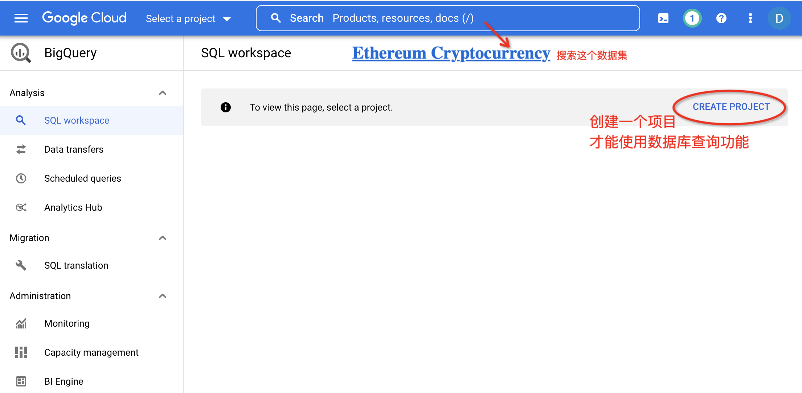
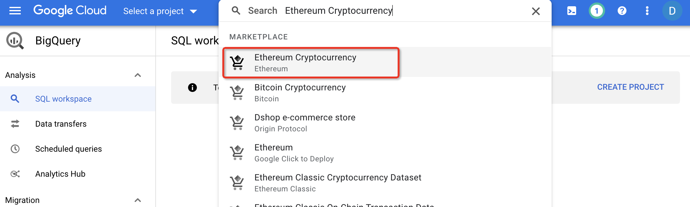
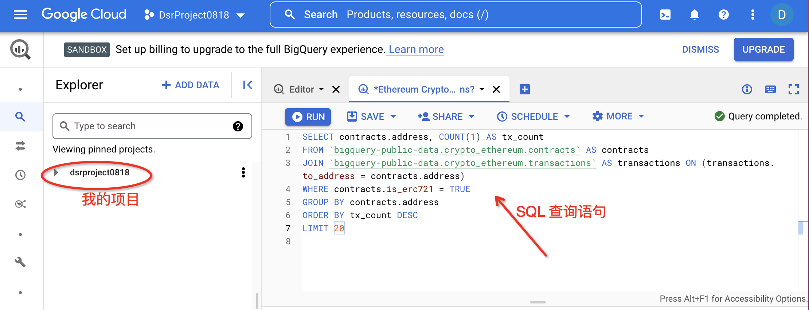
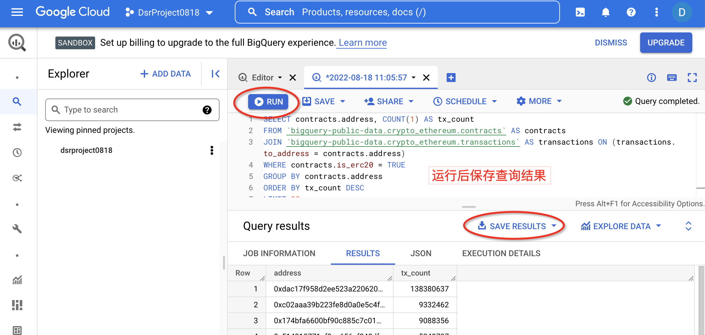

# Ethereum Solidity Smart Contract Analysis
首先通过Google BigQuery沙盒获取合约地址（交易量Top20以及交易量超过8000的ERC20和ERC721合约）；  
其次通过[py-etherscan-api](https://github.com/corpetty/py-etherscan-api)在[etherscan](https://etherscan.io/)上爬取上述合约地址对应的部署信息（包括合约solidity源码、编译器版本，ABI等）。
## 1 BigQuery获取合约地址
BigQuery获取合约地址的方法
使用[Google BigQuery沙盒](https://console.cloud.google.com/projectselector2/bigquery?supportedpurview=project)，创建项目，搜索数据集







### 从Ethereum Cryptocurrency数据集获取
[Ethereum Cryptocurrency](https://console.cloud.google.com/marketplace/product/ethereum/crypto-ethereum-blockchain?q=search&referrer=search&supportedpurview=project)
Transaction data and more from the Ethereum Blockchain
Google Bigquery 数据库查询以太坊合约的 ERC 721 合约示例 ： 
```plsql
SELECT contracts.address, COUNT(1) AS tx_count
FROM `bigquery-public-data.crypto_ethereum.contracts` AS contracts
JOIN `bigquery-public-data.crypto_ethereum.transactions` AS transactions ON (transactions.to_address = contracts.address)
WHERE contracts.is_erc721 = TRUE
GROUP BY contracts.address
ORDER BY tx_count DESC
LIMIT 10
```
```plsql
SELECT contracts.address, COUNT(1) AS tx_count
FROM `bigquery-public-data.crypto_ethereum.contracts` AS contracts
JOIN `bigquery-public-data.crypto_ethereum.transactions` AS transactions ON (transactions.to_address = contracts.address)
WHERE contracts.is_erc20 = TRUE
GROUP BY contracts.address
ORDER BY tx_count DESC
LIMIT 20
```



## 2 爬取合约的部署信息

### 2.1 爬取合约
使用analysis\scripts-win\get_contract_json_1.py 脚本爬取合约信息，爬取的合约内容如下所示：
```json
{
    "SourceCode": "",
    "ABI": "",
    "ContractName": "",
    "CompilerVersion": "",
    "OptimizationUsed": "",
    "Runs": "",
    "ConstructorArguments": "",
    "EVMVersion": "",
    "Library": "",
    "LicenseType": "",
    "Proxy": "",
    "Implementation": "",
    "SwarmSource": ""
}
```

爬取结果存于contracts\json-info目录下，根据合约类型分别存于erc20-8000、erc721-8000等子目录下，各个子目录下进一步按照合约编译器版本分别不同文件夹中。

可见交易数量超过8000的这些合约大多数都是低版本编译器编写的合约。


### 2.2 获取合约源码
使用脚本analysis\scripts-win\parse_sourcecode_2.py 进一步从上述json文件中获取合约源码，也就是提取 "SourceCode" 字段的内容。

提取到的合约源码存放到contracts\source-code路径下，具体存放路径和命名规则与上述json文件类似，只是将文件后缀改为'.sol'。

其中，几个v0.8.x版本下的几笔ERC721交易涉及到多个合约间的调用，这部分合约单独将他们放在了contracts\v0.8.x目录下，并解析出了交易地址涉及到的每个合约，以地址为目录名，解析出的合约放在该目录下，解析合约的脚本：analysis\scripts-win\parse_sourcecode_v8_3.py

## 3 分析合约
TODO:

## Reference
[TxAnalysis](https://github.com/JolyonJian/tx-analysis.git)
