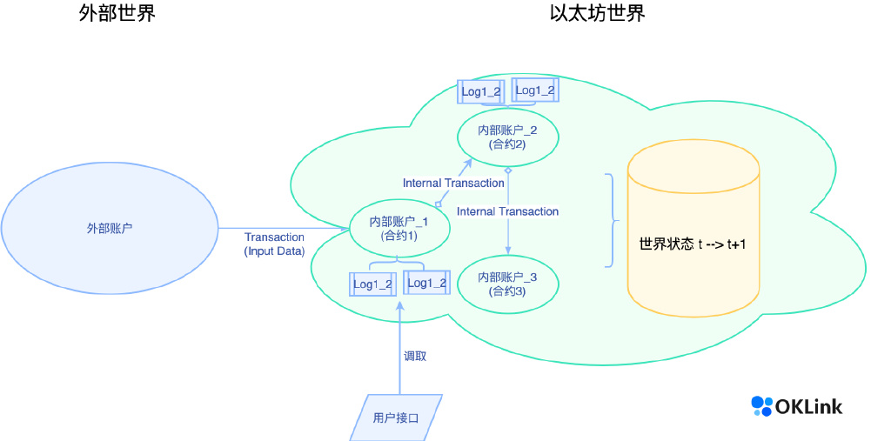
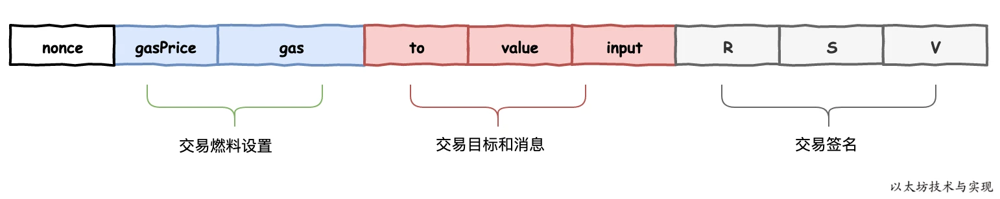

# 1 以太坊交易类型  

- 普通交易｜合约交易  
- 外部账户｜内部账户｜内部交易  
- Transfer｜Transaction｜事件｜日志  

**普通地址交易**是指仅涉及以太坊原生Token (native token)Ether 的转移，不涉及合约的调用以及以太坊中其它 Token 的交易。  
**合约交易**相比普通交易，还多了两个标签:**内部交易**和事件日志。    

## 1.1 外部账户&内部账户  
以太坊的地址（账户）分为外部账户（即实体账户）和内部账户（即合约账户）两种。  
用户通过手中的私钥访问外部地址，而内部地址不能被当作钱包直接访问，只能通过调用它们的函数使用。

外部账户就是以太坊以外世界的实体 (人) 想访问以太坊世界的代理，也是以太坊这个世界计算机的状态发生改变最初始的源头。我们知道以太坊状态的改变由交易（普通交易）发起，如果交易对手为一个智能合约，则交易中的输入数据 (input) 就会作为虚拟机执行合约时的入参触发合约方法。合约方法被调用执行后可能还会触发其它合约中的方法，如此形成一个链式反应，这些链式反应的中间过程即为**内部交易**。如下图：

需要注意的是，由于以太坊区块链中只存储以太坊虚拟机 (EVM) 处理交易后的状态，并不存储计算过程。所以，内部交易信息(合约方法调用链)并不存储在区块链中，而当中发生以太坊转账的结果则最终会更新在 t+1 的世界状态中。其中一部分执行结果会体现在「 Token 转账」(Token Transfer) 里。

## 1.2 Transfer 和 Transaction
交易和事件 1. Transfer 和 Transaction 有何不同？

- Transfer 通常指 Token 归属权的转移，可以分为原生 Token 的转账和其它标准 Token 的转账 (如，ERC20、ERC721 等);
- 而 Transaction 是指交易的发起者，也就是 from 地址 (外部账户)，向矿工提交的交易请求，如果被矿工成功纳入到区块中并完成共识，则该笔交易生效，否则会被告知交易失败。

## 1.3事件日志 (Log)
事件日志 (Log) 是什么？它的作用在哪里？它们都会记录在区块链上吗？

在一个合约源码中，不仅会定义合约方法 (function)，还会定义事件 event abc() 和提交事件 emit abc()，执行过提交的事件就会被记录在日志中，最后日志会被记录在一个调用合约的交易的 receipt 函数中。

然而，在日志中存储事件并不是为了日后可以被智能合约访问，**智能合约是不能监听 (listen) 到日志中的数据的。**事实上，事件用于通知外面的用户区块链上发生的事情。例如，当你在以太坊地址上收到一笔 Token 时，钱包的接口就会为你推送一条到账提醒，这实际上是钱包的前段接口监听到了链上发生的一个事件。由于事件提交事件的代码在合约源码中，它的执行也是以去中心化的方式进行，且最终被保存在区块链上。因此，日志中的数据是可信的。另一个开发者使用事件的原因是日志是一种更便宜的存储方式，日志中存储数据的成本大约是 8 gas/byte，而在合约变量中存储数据的成本为 625 gas/byte。 

## 1.4 小结
外部账户地址之间的交易数据和外部账户地址触发的合约方法执行过程。两种交易都包含交易索引、对手方、交易金额和成本。合约交易中，合约方法的调用过程除了在发起方和接收方之间的一次会被区块链记录，其它合约内部的调用过程均不上链，只有执行的结果和提交事件会被记录在区块链中。​​​

# 2 以太坊的完整交易流程
以太坊中一笔交易的执行流程大致为：

客户端构造交易 -> 通过p2p网络广播交易 -> 矿工节点收到交易 -> 将交易反序列化为 Transaction 结构 -> 将交易放到mempool -> 矿工挖矿 -> 在EVM中执行这笔交易 -> 交易执行结果写入stateDB

在以太坊中，交易的处理是一个过程，从账户发起交易请求开始，到包含该交易的区块被共识节点同步为止(一般来说，出于安全性考虑，会等到该区块后面再“挖”出一些块，这笔交易才算确定)，满足这一个过程才算完成一笔交易。

## 2.1 一笔普通的转账或合约调用的交易过程
1) 发送交易请求  

发送者（用户A）按照格式要求在以太坊网络中发起一个交易请求，该请求被传向用户A的对等节点，如图2所示：  

2) 交易请求的验证和广播

网络上的节点（用户B）同步到此交易，检查交易是否有效、格式是否正确。如果符合要求，计算可能的最大交易费用，确定发送方的地址，并在本地的区块链上减去相应的费用，如果账户余额不足，则返回错误，这条交易废弃。对符合要求的交易请求，用户B将其放在**交易存储池中**，并且转发给其他节点。其他收到交易请求的节点重复用户B的处理过程。如图3所示：  

3）记账节点/矿工节点打包交易和执行合约

- 对于转账交易，**获得记账权的节点**将该交易和其他交易一起打包到区块中；
- 对于合约交易，**矿工**将该交易和其他交易一起打包到区块中，并在**本地的EVM上运行被调用的合约代码**，直到代码运行结束或Gas用完。

如果代码并未结束而Gas已经用完，那么代码运行而改变的状态回滚到代码运行之前,但是已经支付的交易费用不可收回，交易费用有获得记账权的矿工获得。  
如果代码运行结束Gas还有剩余，那么矿工也只会获得消耗Gas x GasPrice作为手续费，不会收取剩余Gas对应的手续费。如图4所示：    

4）区块广播

用户B把包含用户A的交易请求的区块发送至对等节点，并在全网传播。如图5所示：  

5）区块验证同步

其他节点收到该区块后，验证区块  
如果区块通过验证，节点将内存池中原来用户A的交易请求删除，同时同步该区块，将其添加到本地的区块链中。
对于区块中的执行智能合约的交易，其他节点会**在本地的EVM上运行该智能合约**，并互相验证运行的结果。如图6所示：  

通过上面五个步骤，整个交易的过程已经结束。但是一般来说，当包含交易的区块链被同步到区块链后，出于安全性的需求，还需要再挖掘一些块，这笔交易才能算是真正地被确认。

# reference  
[如何通过链上数据，看懂以太坊交易信息](https://weibo.com/ttarticle/x/m/show/id/2309404748406345302162?_wb_client_=1)
[以太坊中一笔交易的执行流程](https://www.jianshu.com/p/f6ded97769c5)
[图解以太坊交易](https://blog.csdn.net/chyMX/article/details/86422493)
